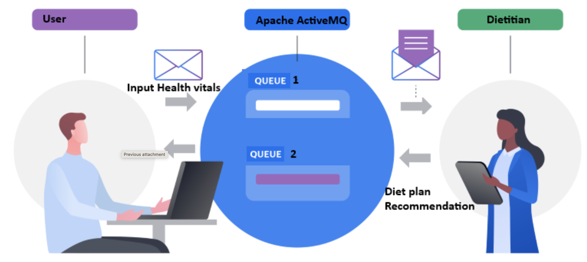

# Diet Recommender System

This is a robust 2-tier application that facilitates diet management and recommendation. The system has the user roles: **User**, **Dietitian**, and **Admin**. It is split up into two, each operating on separate ports. The application is designed with scalability, security, and reliability in mind.

---


## **Swagger UI**
Explore and test the API endpoints interactively:


Hosted at: [Microsoft Azure Cloud Platform](https://cs544-app.azurewebsites.net/swagger-ui/index.html#/)


---

## **Entities**

### 1. **Users**
- Represents individuals using the application to track their diet and receive recommendations.
- Attributes include username, email, password, and role (USER or DIETITIAN).

### 2. **FoodLogs**
- Logs meals consumed by users, including details like meal type, food items, calories, and nutrients.
- Associated with a specific user.

### 3. **Health Vitals**
- Captures vital health information for users, such as weight, height, BMI, and medical conditions.
- Provides critical data for tailored diet recommendations.

### 4. **Diet Review**
- Allows dietitians to review and provide feedback on user meal plans.
- Includes attributes like review text and status (PENDING, APPROVED).

### 5. **Diet Recommendation**
- System-generated or dietitian-approved meal plans tailored to user health vitals and food logs.
- Includes status tracking (PENDING, APPROVED, REJECTED).

---

## **Features**

### **1. CRUD Operations**
- Fully functional endpoints for Create, Read, Update, and Delete operations on all entities.

### **2. Query Capabilities**
- **Dynamic Queries**: Example - Fetch all food logs for a specific user within a date range.
- **Named Queries**: Example - Retrieve diet recommendations by status (PENDING, APPROVED).
- **Criteria Queries**: Example - Fetch diet reviews for users with a specific BMI range.

### **3. 5-Layer Architecture**
- **Presentation Layer**: Exposes endpoints through REST API.
- **Control Layer**: Coordinates business logic.
- **Service Layer**: Contains core logic and transaction management.
- **Domain Layer**: Represents business objects like Users, FoodLogs, etc.
- **Persistence Layer**: Handles database interactions using Spring Data JPA.

### **4. Logging Transactions with AOP**
- Logs every REST API call to `log.txt` for monitoring and debugging.
- Example: When a food log is saved, a log entry is recorded.

### **5. JMS Integration**
- **User Updates Meal Plan**: A message is sent to ActiveMQ, notifying the dietitian.
- **Dietitian Approves Meal Plan**: A message is sent to ActiveMQ, notifying the user.
- Uses ActiveMQ queues for communication between roles.

### **6. Profiles for Development and Production**
- **Development Profile**: Uses `application_h2.properties` for H2 in-memory database.
- **Production Profile**: Uses `application_mysql.properties` for MySQL database.

### **7. Security**
- **Spring Security Implementation**:
  - **Write Endpoints**: Accessible only by Admin (`username: admin, password: admin`).
  - **Read Endpoints**: Accessible by User (`username: user, password: user`).
- Restricts sensitive operations and enforces role-based access control.

### **8. Swagger Integration**
- Swagger UI for testing and exploring APIs.
- Hosted at: [Swagger UI](https://cs544-app.azurewebsites.net/swagger-ui/index.html#/)

### **9. Deployment**
- Deployed on Microsoft Azure as a scalable App Service.
- Production URL: [Diet Recommender System](https://cs544-app.azurewebsites.net/swagger-ui/index.html#/)

---

## **System Architecture**

### **JMS Architecture**


---

## **Ports**
- **User System**: Runs on port `6060`.
- **Dietitian System**: Runs on port `7070`.

---

## **How to Run Locally**
1. Clone the repository.
2. Build the application:
   ```bash
   mvn clean package
   ```
3. Run the application:
   ```bash
   java -jar target/recommender-0.0.1-SNAPSHOT.jar
   ```
4. Access the application at:
   - Swagger UI: [http://localhost:6060/swagger-ui/index.html](http://localhost:6060/swagger-ui/index.html)

---

## **How to Deploy to Azure**
1. Create a resource group:
   ```bash
   az group create --name diet_group --location canadacentral
   ```
2. Create an App Service Plan:
   ```bash
   az appservice plan create --name cs544_b --resource-group diet_group --sku B1 --is-linux
   ```
3. Create a Web App:
   ```bash
   az webapp create --resource-group diet_group --plan cs544_b --name cs544-app --runtime "JAVA:21-java21"
   ```
4. Deploy the WAR file:
   ```bash
   az webapp deploy --resource-group diet_group --name cs544-app --src-path target/recommender-0.0.1-SNAPSHOT.war
   ```

---

## **Contact Information**
For questions or issues, please contact the development team.

---

Enjoy using the Diet Recommender System!

